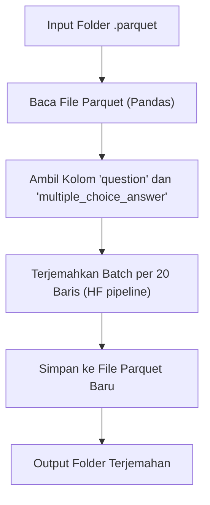

---

# 🗣️ Parquet English–Indonesian Translator

Skrip ini digunakan untuk **menerjemahkan dataset dalam format `.parquet`** yang berisi teks berbahasa Inggris ke dalam **Bahasa Indonesia**, menggunakan model **Hugging Face `Helsinki-NLP/opus-mt-en-id`**.

## 📋 Deskripsi Proyek

Skrip ini memproses seluruh file `.parquet` di sebuah folder input, menerjemahkan kolom teks seperti `question` dan `multiple_choice_answer`, lalu menyimpan hasil terjemahan ke folder output dalam format `.parquet` baru.
Proses diterjemahkan dilakukan secara **batching** dan **progress bar** menggunakan `tqdm` agar lebih efisien dan mudah dipantau.

---

## ⚙️ Fitur Utama

* ✅ Mendukung **batch translation** (20 baris per iterasi) untuk efisiensi.
* ✅ Menggunakan **model machine translation** berbasis Transformer (`Helsinki-NLP/opus-mt-en-id`).
* ✅ Kompatibel dengan CPU maupun GPU (`--use_gpu`).
* ✅ Mendukung banyak file `.parquet` sekaligus dalam satu eksekusi.
* ✅ Menampilkan progress dengan `tqdm`.

---

## 🧠 Arsitektur Logika



---

## 🧰 Instalasi

Pastikan sudah menyiapkan **virtual environment (venv)** dan menginstal dependensi berikut:

```bash
pip install torch transformers pandas tqdm pyarrow
```

---

## 🚀 Cara Menjalankan

Jalankan perintah berikut di terminal:

```bash
python terjemahversi3.py \
  --input_dir "/path/ke/folder_input" \
  --output_dir "./vqav2_translated_parquet" \
  --use_gpu
```

### Parameter Penjelasan:

| Parameter      | Wajib    | Deskripsi                                              |
| -------------- | -------- | ------------------------------------------------------ |
| `--input_dir`  | ✅        | Folder berisi file `.parquet` sumber berbahasa Inggris |
| `--output_dir` | ✅        | Folder tujuan hasil terjemahan                         |
| `--use_gpu`    | opsional | Aktifkan penggunaan GPU jika tersedia (default: CPU)   |

Contoh eksekusi:

```bash
(venvtrainingllm) openai@openai:~/trainingllm/dataset/dataset$ python terjemahversi3.py \
  --input_dir "/home/openai/.cache/huggingface/hub/datasets--merve--vqav2-small/snapshots/4b070c6254225a7355070c94e14c3275606f521d/data" \
  --output_dir "./vqav2_translated_parquet" \
  --use_gpu
```

---

## 📂 Struktur Folder

```
dataset/
├── terjemahversi3.py
├── vqav2_translated_parquet/
│   ├── file1.parquet
│   ├── file2.parquet
│   └── ...
└── original_data/
    ├── file1.parquet
    ├── file2.parquet
    └── ...
```

---

## 🧩 Fungsi Utama

| Fungsi                     | Deskripsi                                                                              |
| -------------------------- | -------------------------------------------------------------------------------------- |
| `translate_batch()`        | Menerjemahkan daftar teks dalam batch menggunakan pipeline HF                          |
| `translate_parquet_file()` | Membaca satu file `.parquet`, menerjemahkan kolom yang ditentukan, dan menyimpan hasil |
| `main()`                   | Mengatur argumen CLI dan memproses semua file di direktori input                       |

---

## ⚡ Catatan Tambahan

* Gunakan GPU (`--use_gpu`) untuk performa yang lebih cepat, terutama pada dataset besar.
* Pastikan model sudah otomatis diunduh dari Hugging Face saat pertama kali dijalankan.
* Jika ada error “CUDA not available”, jalankan tanpa `--use_gpu` agar tetap berjalan di CPU.

---

## 📜 Lisensi

Proyek ini menggunakan model terbuka dari [Hugging Face Transformers](https://huggingface.co/Helsinki-NLP/opus-mt-en-id) dan dapat digunakan untuk keperluan penelitian maupun eksperimen non-komersial.

---

Apakah Kakak ingin saya tambahkan bagian **contoh hasil input-output (before vs after translation)** juga di README-nya? Itu bisa membantu dokumentasi GitHub-nya lebih interaktif.
