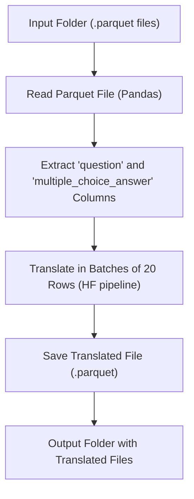

Here’s the English version of the **README.md** for your project:

---

# 🗣️ Parquet English–Indonesian Translator

This script is used to **translate `.parquet` dataset files** containing English text into **Indonesian**, using the **Hugging Face model `Helsinki-NLP/opus-mt-en-id`**.

## 📋 Project Description

The script processes all `.parquet` files in an input folder, translates text columns such as `question` and `multiple_choice_answer`, and saves the results into a new output folder in `.parquet` format.
Translation is performed in **batches** with real-time progress tracking using `tqdm`, making the process efficient and easy to monitor.

---

## ⚙️ Key Features

* ✅ Supports **batch translation** (20 rows per iteration) for efficiency
* ✅ Uses **Transformer-based translation model** (`Helsinki-NLP/opus-mt-en-id`)
* ✅ Works with both **CPU and GPU** (`--use_gpu` flag)
* ✅ Automatically processes all `.parquet` files in a directory
* ✅ Displays real-time progress via `tqdm`

---

## 🧠 Logical Workflow



---

## 🧰 Installation

Set up your Python virtual environment and install the required dependencies:

```bash
pip install torch transformers pandas tqdm pyarrow
```

---

## 🚀 How to Run

Execute the script with the following command:

```bash
python terjemahversi3.py \
  --input_dir "/path/to/input_folder" \
  --output_dir "./vqav2_translated_parquet" \
  --use_gpu
```

### Argument Description

| Argument       | Required | Description                                               |
| -------------- | -------- | --------------------------------------------------------- |
| `--input_dir`  | ✅        | Directory containing original `.parquet` files in English |
| `--output_dir` | ✅        | Destination folder for translated output files            |
| `--use_gpu`    | Optional | Enables GPU acceleration if available (default: CPU)      |

Example execution:

```bash
(venvtrainingllm) openai@openai:~/trainingllm/dataset/dataset$ python terjemahversi3.py \
  --input_dir "/home/openai/.cache/huggingface/hub/datasets--merve--vqav2-small/snapshots/4b070c6254225a7355070c94e14c3275606f521d/data" \
  --output_dir "./vqav2_translated_parquet" \
  --use_gpu
```

---

## 📂 Folder Structure

```
dataset/
├── terjemahversi3.py
├── vqav2_translated_parquet/
│   ├── file1.parquet
│   ├── file2.parquet
│   └── ...
└── original_data/
    ├── file1.parquet
    ├── file2.parquet
    └── ...
```

---

## 🧩 Main Functions

| Function                   | Description                                                                              |
| -------------------------- | ---------------------------------------------------------------------------------------- |
| `translate_batch()`        | Translates a list of text strings in batches using the Hugging Face translation pipeline |
| `translate_parquet_file()` | Reads a `.parquet` file, translates specific columns, and saves the output               |
| `main()`                   | Parses CLI arguments and processes all `.parquet` files in the input directory           |

---

## ⚡ Notes

* Use `--use_gpu` for faster performance when translating large datasets.
* The model will be automatically downloaded from Hugging Face on first use.
* If you encounter the error `CUDA not available`, simply run the script without `--use_gpu` to fall back to CPU.

---

## 📜 License

This project uses the open translation model [Helsinki-NLP/opus-mt-en-id](https://huggingface.co/Helsinki-NLP/opus-mt-en-id) from Hugging Face and is intended for **research and non-commercial use**.

---

Would you like me to add a **“Sample Input–Output Translation Example”** section next? It can help make the README more practical for readers on GitHub.
